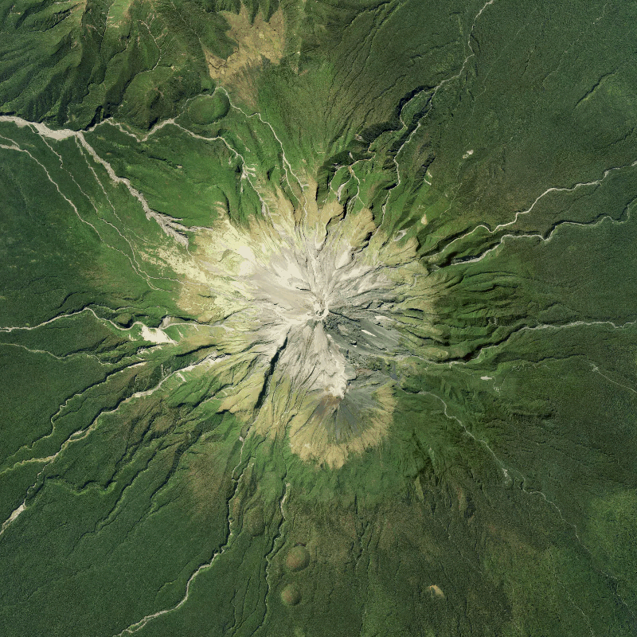
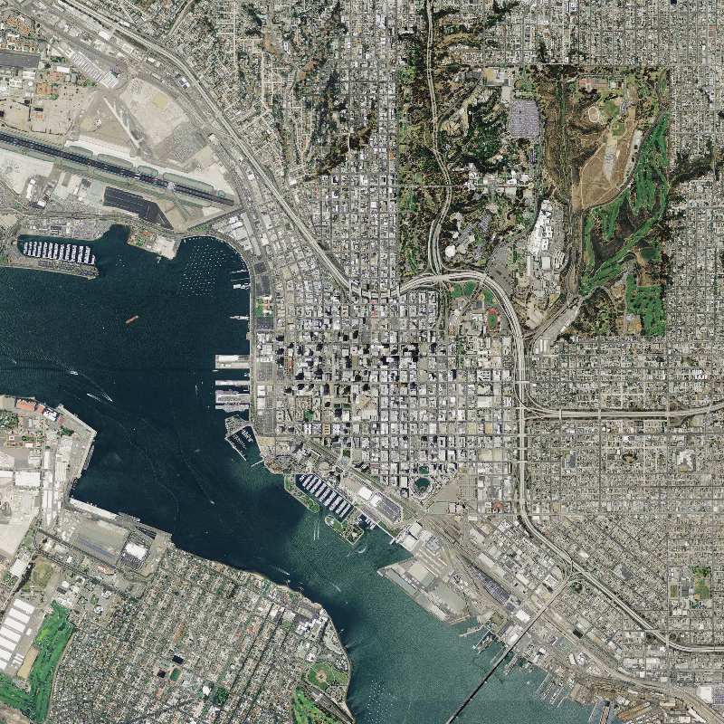
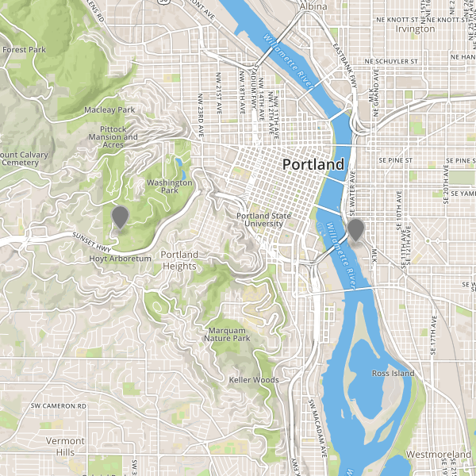

# Static map images

We know the coordinate of our destination (Mount Taranaki in New Zealand)

```
$ lat="-39.2978"
$ lon="174.0632"
```

Now let's see what that region looks like using the `mapbox.satellite` map featuring [super high-res 
imagery from Land Information New Zealand](https://www.mapbox.com/blog/new-zealand-aerial/)

Here we request an 800x800 PNG image at zoom 13
```
$ mapbox staticmap --lat $lat --lon $lon --zoom 13 --size 800 800 mapbox.satellite taranaki_sat.png
```



Of course we don't need to manually type the coordinates. With a short bash function,
we can grab the lat/lon from the geocoding results and create a map

```bash
function showme() {
    local location="$(mapbox geocoding "$1" | jq -c .features[0])"
    local lon=$(echo $location | jq .center[0])
    local lat=$(echo $location | jq .center[1])
    local tmp=$(mktemp $TMPDIR/$(uuidgen).XXX.png)
    mapbox staticmap --lat $lat --lon $lon --zoom ${2:-13} --size 800 800 \
        mapbox.satellite $tmp
    if [ "$(uname)" = "Linux" ]; then
        xdg-open $tmp
    else
        open $tmp
    fi
}
```

Which you use like so, in this case to get an image of downtown San Digeo at zoom 14

```
$ showme "San Diego, CA" 14
```




You can also render small GeoJSON feature collections using the `--features` option.

```
mapbox staticmap --features waypoints.geojson mapbox.streets portland.png
```


